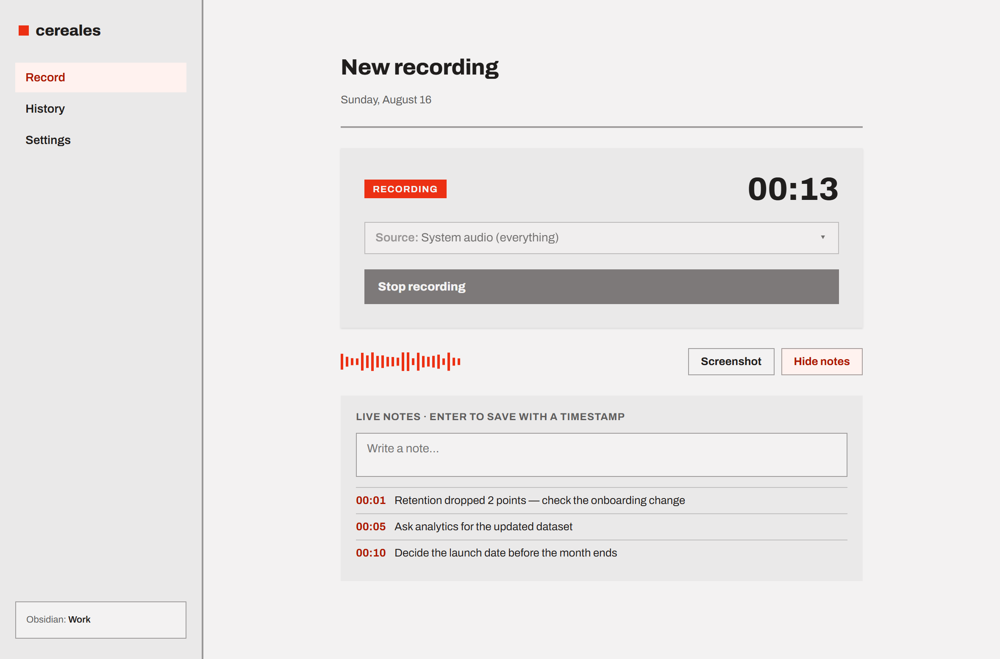
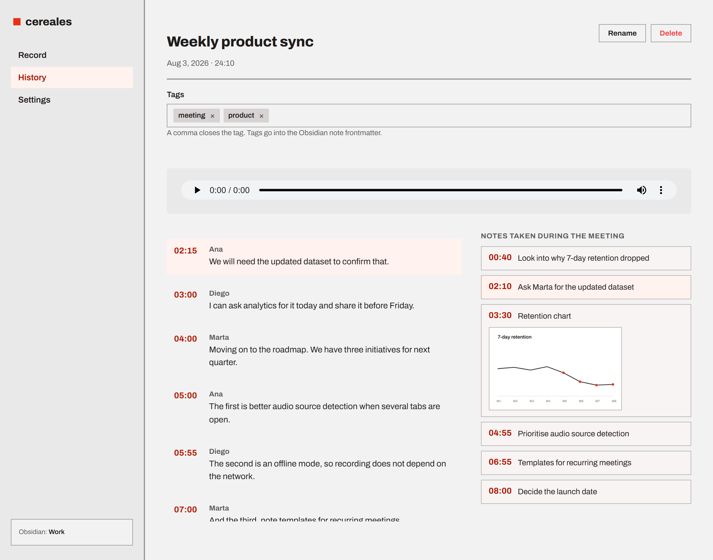
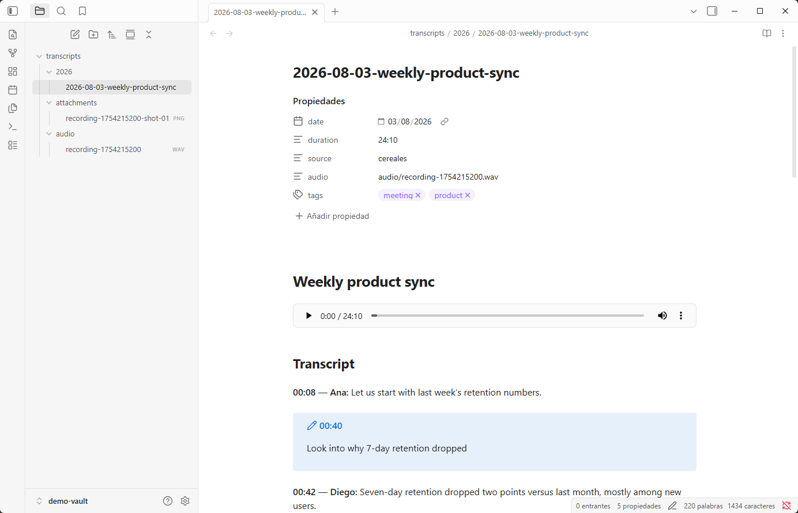
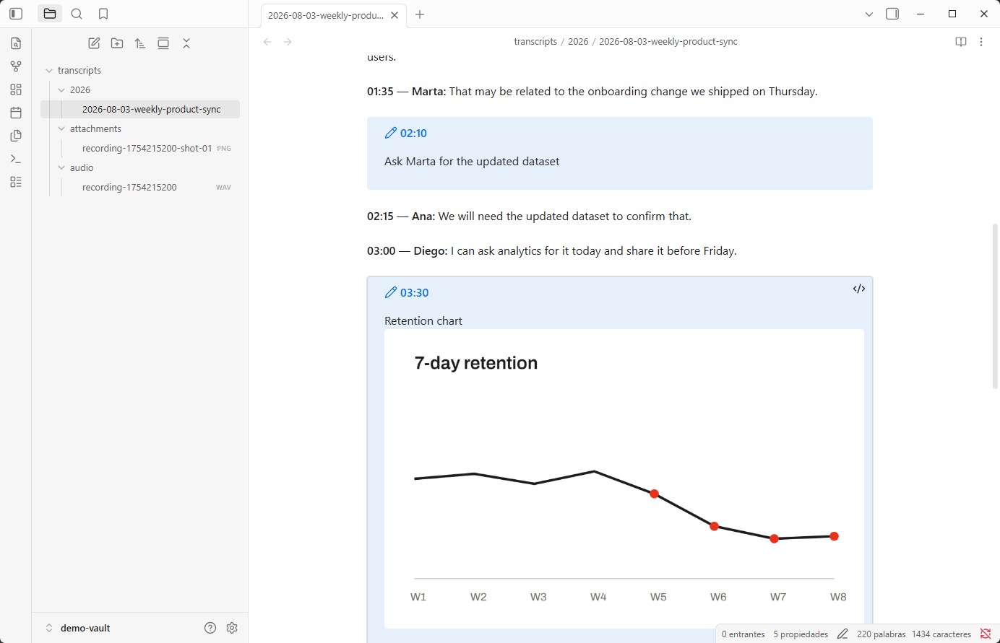
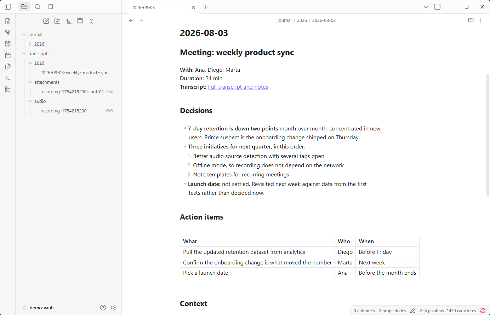
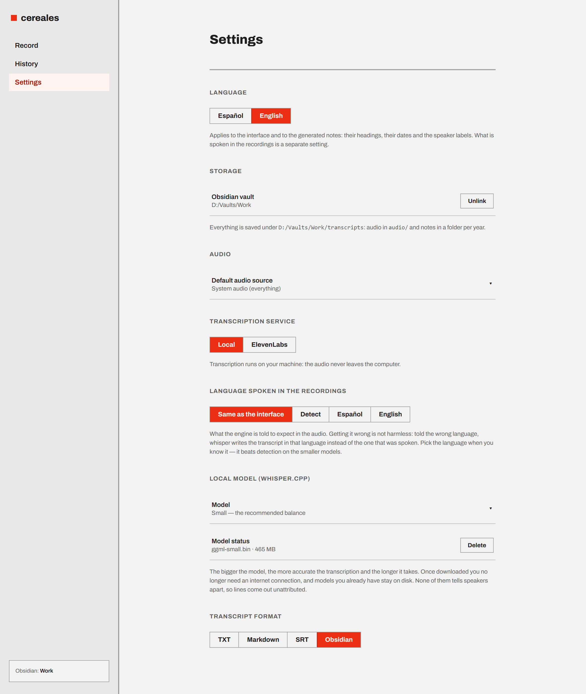

# cereales

Desktop meeting recorder: it records the system audio, a microphone or one
specific application, transcribes it **locally**, and lets you take timestamped
notes that link back to the exact point in the transcript.

The interface is available in **English and Spanish**, and is ported from the
Claude Design prototype (`cereales.dc.html`).



Every note is stamped with the second it was written at, so the transcript and
the notes stay side by side afterwards: clicking a note moves the player and
lights up the sentence that was being said.



> The screenshots use the sample data the interface ships with for `npm run
> dev`; the meetings in them never happened.

## Motivation

Granola got the workflow right: you record the meeting, it transcribes itself,
and the notes you write stay anchored to the exact minute each thing was said,
so reviewing an hour-long meeting does not mean listening to it again. The
problem is not the product, it is what sits underneath: it is closed, paid by
subscription, macOS only, and the audio of all your meetings — the internal
ones, the client ones, the ones that should never leave the company — ends up on
somebody else's server.

cereales copies that workflow and drops that part. It is open source, it runs on
your machine and it transcribes locally with whisper.cpp: by default the audio
never leaves the computer and there is no account, no key and no subscription.
Anyone who prefers better quality and wants to know who spoke can pick ElevenLabs
Scribe in Settings, but that is an explicit, deliberate decision rather than what
happens by default.

### What this early version is

What is here works end to end — recording from the system, a microphone or an
application; transcribing; taking linked notes; exporting to TXT, Markdown, SRT
or an Obsidian note — but it is an early version and it shows:

- **Windows only.** Capture is written against WASAPI. macOS and Linux need a
  different implementation, not a patch.
- **No automatic summaries.** That is Granola's headline feature and it does not
  exist here yet: cereales gives you the transcript and your notes, not a
  written-up set of minutes. The note is plain Markdown in your vault, though,
  so an assistant can write them from it — see [Summaries are somebody else's
  job](#summaries-are-somebody-elses-job).
- **No sync and no cloud.** Recordings and notes live on your disk. No accounts,
  no sharing, no mobile app.
- **No calendar integration.** Meetings are started by hand; nothing notices you
  have a call at 10:00.

## How it works

- **Capture**: WASAPI directly (`src-tauri/src/audio/win.rs`). Three modes down
  the same code path: microphone, loopback of the output endpoint (all the
  system audio) and *process loopback* for one specific application.
- **Transcription**: whisper.cpp through `whisper-rs`, running on your CPU. The
  audio never leaves the machine. The model is picked in the settings — from
  `tiny` to `large-v3-turbo`, trading speed for accuracy — and several can be
  kept on disk at once.
- **Storage**: there is a single folder to choose, the Obsidian vault. Inside
  `transcripts/` the audio goes to `audio/` and the notes are grouped by year.
  With no vault linked, `Documents/cereales` is used with that same structure.

### Languages

The interface ships in English and Spanish, picked in **Settings → Language**.
Until you choose one, cereales follows the system language, so an existing
install does not change language on upgrade.

The choice does more than relabel buttons: it also decides the section headings
of the notes that get written (`## Notes` / `## Notas`), how dates are formatted
and the speaker labels on transcripts that have them.

What language is *spoken* in the recordings is a second, separate setting, in
**Settings → Language spoken in the recordings**: the interface language, the
engine's guess (`Detect`), or an explicit one. It defaults to following the
interface, which is what the app did when the two were a single setting.

Getting it wrong is worth avoiding. whisper conditions its decoder on the
language it is told to expect, so announcing English over Spanish speech makes
it write the transcript in English — it effectively translates, even though the
app never asks it to. Pick the language explicitly when you know it: on the
smaller models a hint beats detection.

Every user-visible string lives in `src/i18n/`. `en.ts` is the source of truth
for the keys and `es.ts` is typed against it, so a key added without a Spanish
translation fails `npm run typecheck` rather than quietly rendering English.

### Built for Obsidian

The default format is an Obsidian note: frontmatter with the date, the duration
and your tags, the audio embedded with `![[…]]` so it plays from the note
itself, and the notes you took during the meeting as *callouts* attached to the
sentence you wrote them against. Tags are edited on the recording screen. TXT,
Markdown and SRT are still in Settings for anyone who wants them.



Nothing in that note is written by a plugin: it is a plain Markdown file, and
the vault only gains the three folders on the left. A screenshot taken during
the meeting is a note like any other, so it lands in its callout with the rest.



### Summaries are somebody else's job

cereales does not write minutes, and the transcript it leaves is deliberately
literal — it is what was said, not what it meant. What being plain Markdown in
your own vault buys you is that anything you already use on your notes works on
this one too: hand the transcript and the notes to an assistant, ask for the
decisions and who owes what, and file the answer next to it.



That note is written by Claude, not by cereales, and it stays a separate file on
purpose. A summary is a judgement about a meeting the app did not attend, so a
bad one has to be throwable without taking the recording, the transcript or the
notes with it — and the `[[…]]` link back means the literal version is always
one click away when the summary is wrong.

### Name migration

The first versions wrote Spanish names to disk: a `transcripciones/` folder
inside the vault, and WAVs called `grabacion-1754640000.wav`. Those names are
now `transcripts/` and `recording-…`, and existing installs are migrated
automatically the first time the app starts.

The WAV prefix is not decoration — the filename stem *is* the id of a recording
— so the migration moves the whole chain together: the WAV, its metadata
sidecar and the `id` inside it, the structured transcript in the config folder,
and the `![[…]]` embed plus the `audio:` frontmatter of the Obsidian note. The
note is edited surgically: only that filename changes, so anything you wrote in
it by hand survives.

It is deliberately timid. Nothing is ever deleted, a destination name that is
already taken is skipped rather than overwritten, and whatever it could not move
stays readable through the legacy folders, so the history never empties out.
Running it again is a no-op, which is why it simply runs on every startup.

### Windows only

Capture is Windows-specific. On other systems the app compiles, but the audio
commands return an explicit error rather than pretending to work. *Process
loopback* needs Windows 10 2004 (build 19041) or later.

### Limits worth knowing about

- **You cannot capture one specific browser tab.** The prototype offered it, but
  Windows captures per *process* and a browser puts all of its tabs in the same
  tree. What you will see in the dropdown is the whole application ("chrome",
  "Zoom"), which is why the "Browser tabs" group no longer exists.
- **whisper.cpp does not tell speakers apart.** Transcript lines come out with
  no name; the UI hides that line rather than inventing a "Speaker 1". Real
  diarization would need a different backend (Deepgram, AssemblyAI), which means
  uploading the audio to a third party.
- **whisper invents labels during silences** ("[MUSIC]", "[BLANK_AUDIO]"). They
  are dropped when the segments are read: besides not being speech, they
  competed for the jump from a note and could steal the spot from the real
  sentence.

### Silences are padded by hand

In loopback, WASAPI delivers no packets while nothing is playing. Without
compensating for it, the WAV comes out shorter than the meeting and the
timestamps stop matching the notes. The capture thread keeps its own clock and
pads the gaps with silence; `captured_duration_tracks_the_clock` covers that
property.

### Audio is stored as mono 16 kHz

That is what whisper consumes and it is plenty for speech; it avoids storing the
original and resampling again later. To keep the full quality of the recording
you would have to change `OUT_RATE` and the `WavSpec` in `audio/win.rs` and
resample at transcription time.

## Requirements

- Node 20+
- Rust (`x86_64-pc-windows-msvc` toolchain)
- MSVC Build Tools with "Desktop development with C++"
- CMake and LLVM/libclang — `whisper-rs` needs them to build whisper.cpp

```bash
winget install Rustlang.Rustup Kitware.CMake LLVM.LLVM
```

## Usage

```bash
npm install
npm run tauri:dev
```

The first time, a model has to be downloaded from **Settings → Local model**.
The dropdown lists the whole catalogue with its size, from `tiny` (~75 MB) to
`large-v3-turbo` (~1.6 GB); `small` (~490 MB) is the default and the sensible
balance. Picking one does not download it — that is the button next to it — and
downloaded models stay on disk until you delete them from that same screen.

Without a model you can still record, but transcription fails with a warning and
the recording is kept anyway.



The interface alone, in a browser and with sample data (no Rust needed):

```bash
npm run dev
```

Checks:

```bash
npm run typecheck && npm run build
```

The Rust tests run against the machine's real WASAPI: they enumerate devices,
actually record from the microphone, the system and an application, and
transcribe a speech sample. Only the transcription one is skipped, when the
model is not downloaded.

```bash
cd src-tauri && cargo test --lib -- --test-threads=1
```

## Versioning

Versions publish themselves. On a push to `main`, GitHub Actions infers the bump
from the commit messages ([Conventional
Commits](https://www.conventionalcommits.org/)), updates the version, creates
the `vX.Y.Z` tag and publishes the release:

| Commit | Bump |
| --- | --- |
| `feat!:` or `BREAKING CHANGE` in the body | major |
| `feat:` | minor |
| `fix:`, `perf:`, `chore:`, … | patch |

The version lives in five files (`package.json`, `package-lock.json`,
`src-tauri/tauri.conf.json`, `src-tauri/Cargo.toml` and `src-tauri/Cargo.lock`)
and a single script keeps them in sync, so **they are never edited by hand**:

```bash
node .github/scripts/bump-version.mjs minor
```

To force a specific level without depending on the commits: **Actions → Version
bump → Run workflow**. The details are in [CLAUDE.md](CLAUDE.md).

## Architecture

```
src/
  i18n/            Message catalogues (en.ts is the source of truth) + React provider
  services/        Boundary with the native world
    types.ts       Interfaces (AudioService, TranscriptionService, StorageService)
    native.ts      Wrapper over the Tauri commands
    mock.ts        Browser equivalent, for `npm run dev`
    index.ts       Picks one or the other based on isTauri()
  state/store.tsx  App state (React context)
  screens/         Record · History · Settings · Transcript
  components/      Sidebar, SourcePicker, ModelPicker, TagInput, Waveform
  lib/             Time formatting, serialization, note names, error translation
  styles/          tokens.css (prototype palette) + global.css + app.css
src-tauri/src/
  audio/win.rs     WASAPI capture: enumeration and the three modes
  audio/mod.rs     Recorder commands and state
  transcription.rs whisper.cpp + the model catalogue and its downloads
  dsp.rs           Mono mixdown, resampling and level meter
  storage.rs       Settings, recording index, transcript writing
  model.rs         Types shared with the frontend (camelCase through serde)
  errors.rs        Error keys the frontend translates
```

Command names and payload shapes are pinned in `src/services/native.ts` and
`src-tauri/src/model.rs`: if you change one, change the other.

Events the backend emits:

| Event | Payload | What for |
| --- | --- | --- |
| `audio://levels` | `number[]` of 24 values 0..1 | Meter bars while recording |
| `model://progress` | `{ percent, stage }` | Model download and transcription progress |

## Notes

- Transcript serialization lives in TypeScript (`src/lib/serialize.ts`); Rust
  only writes the bytes, so the formats have a single implementation.
- Rust never returns prose to the user: a failing command returns a stable error
  key (`src-tauri/src/errors.rs`) that the frontend translates.
- Recordings made before v0.3 used Spanish names on disk — a `transcripciones/`
  folder and a `grabacion-` prefix on the WAVs. They are renamed automatically
  on startup; see [Name migration](#name-migration).
- The icons in `src-tauri/icons/` are generated placeholders. To replace them:
  `npm run tauri icon path/to/icon.png`.
- `csp` is `null` in `tauri.conf.json` because the Archivo font is loaded from
  Google Fonts. Bundling the font locally and turning on a strict CSP is still
  pending.
